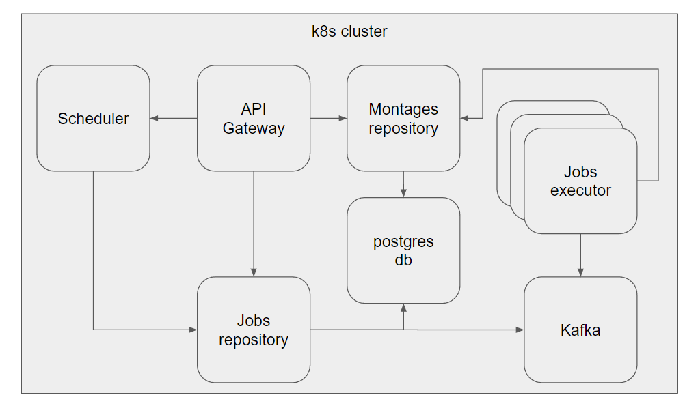

# Stream Montages

Application to build montages of streams.

## Prerequisites

### Kubernetes

This app is composed of multiple services that all live under a Kubernetes cluster.

You can follow [this](https://docs.docker.com/desktop/kubernetes/) link for enabling Kubernetes on Docker Desktop.

Also, you should be a bit comfortable with Kubernetes (deploying services, deleting them, etc.).
Otherwise debugging will be a great learning experience!

### Stream Highlights Provider

You have a way to provide stream highlights, with details on their **video urls** and **timestamps**.

For example, the `nijisanji-en-scheduler` lambda function in this repo fetches from a DynamoDB table
containing stream highlights of the Nijisanji EN streamers, compiles the highlights and schedules montage jobs
accordingly.

You can create you own scheduler to work with your own kind of data, wherever it may be. Just note that the rest
of the application works with the core idea that a montage is composed of stream highlights, each associated with
a video url and a timestamp.

### OpenAI API Key

This app involves creating transcription files alongside the created montages. Transription is done through
the audio model by [OpenAI](https://platform.openai.com/).

Note this isn't a *hard* requirement as you can always just comment out the code around it.
Implying you'll need to rebuild the Docker image and adjust the cluster accordingly.

## Architecture



### Workflow Overview

1. *Scheduler* runs and posts to the *jobs repository* to create the montage job.
2. *Jobs repository* publishes the job details to a *Kafka* topic.
3. *Jobs executor* consumes the message from the topic, creates the montage video file,
and posts to *montages repository* to complete the job.

The *API gateway* serves as the bridge between outside the cluster (ex. your browser) and the three key services:
*Scheduler*, *Jobs repository*, *Montages repository*.

A *postgres db* persists the jobs and montages repositories' data.

## Getting Started

Make sure your local k8s cluster is up and that you can run `kubectl` commands.

```sh
kubectl version
```

Create the necessary k8s secrets:

1. `jobs-executor-secrets` containing the key-value pair: `SM_OPENAI_API_KEY=<your-api-key>`

Deploy the Kafka component:

```sh
kubectl apply -f deployment/kafka/.
```

Change the paths in `deployment/postgres.local.yaml` and `deployment/montage-jobs-executor.yaml`.

```txt
  hostPath:
    path: "/run/desktop/mnt/host/e/k8s/postgres/data" # docker desktop on Windows, adjust path accordingly

  hostPath:
    path: "/run/desktop/mnt/host/e/k8s/stream-montages" # docker desktop on Windows, adjust path accordingly
```

These indicate where to persist the postgres data and where to store the montage video files, respectively.

Deploy the rest of the services:

```sh
kubectl apply -f deployment/.
```

If you need to debug the postgres component, you can deploy the k8s NodePort to reach the db:

```sh
kubectl apply -f deployment/debug/postgres-debug.local.yaml
```

It would be accessible through `http://localhost:30475`.

## Troubleshooting

> I don't see the montages / jobs tables in postgres.

You may need to create the schema first. Create the schema `stream_montages` and then restart the repository pods,
make sure they can migrate the db successfully.

> Only one jobs executor pod is consuming the Kafka messages.

I also had a ton of trouble with this. See [this github issue](https://github.com/wurstmeister/kafka-docker/issues/661) 
for a possible explanation. Seems like you just need to keep restarting the Kafka broker pod until it creates the topic
with the correct number of partitions.
